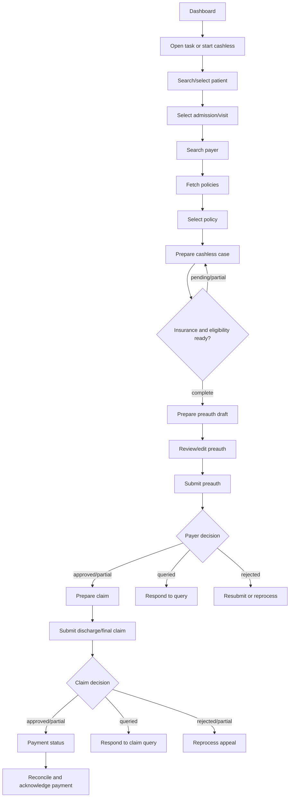
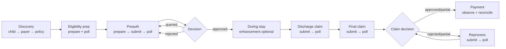
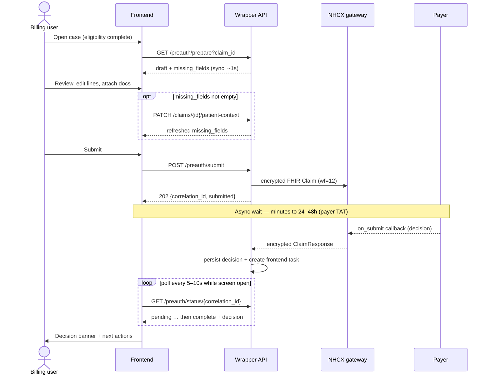
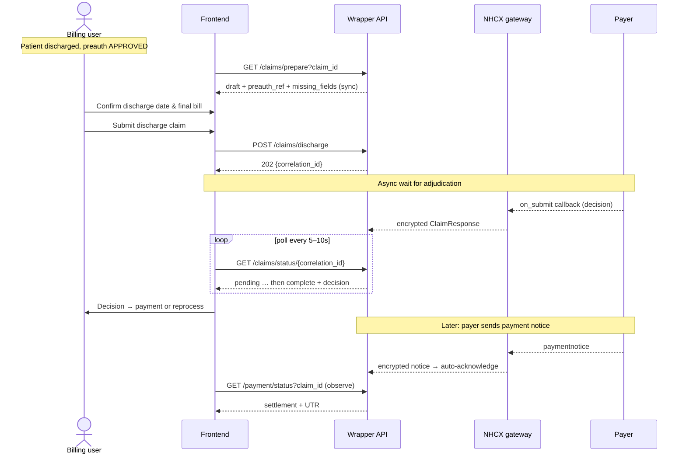
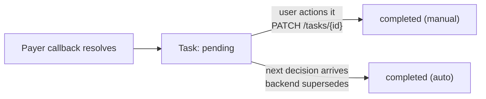
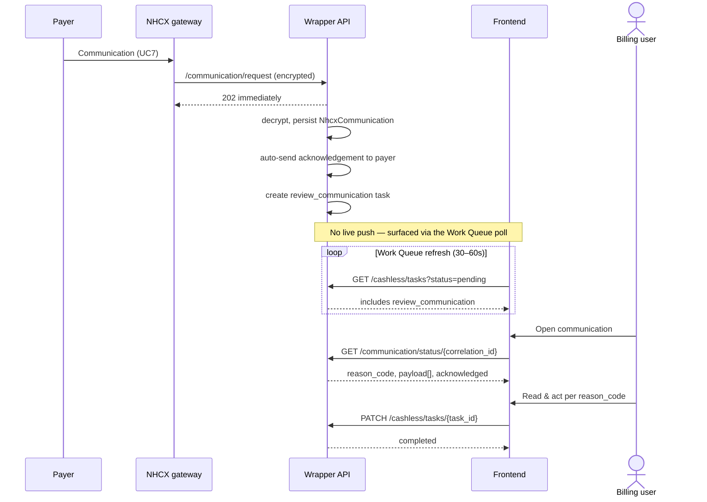

# NHCX Frontend Implementation Guide

This guide translates [FRONTEND_API.yaml](FRONTEND_API.yaml) into a hospital-facing frontend experience. The UI calls only the wrapper API under `/nhcx/backend/api/v1/insurance`; it never calls NHCX directly.

The product goal is to help billing and insurance desk users move a patient from cashless discovery to preauth, claim submission, reprocess, payment reconciliation, and payer communication handling with the fewest context switches.

## Product Shape

Build the frontend as an operations workspace, not a marketing-style flow. Users need dense information, clear next actions, visible blockers, and fast recovery from payer queries.

Primary areas:

| Area | User Intent | Main APIs |
|---|---|---|
| Dashboard | Know what needs attention today | `GET /cashless/dashboard/stats`, `GET /cashless/dashboard/claims`, `GET /cashless/tasks` |
| Patient Profile | See everything about one patient before acting | `GET /cashless/child`, `GET /cashless/dashboard/claims?child_id=`, `GET /cashless/tasks?child_id=` |
| Cashless Wizard | Start a cashless workflow for one patient | `GET /cashless/child`, `GET /cashless/payers/search`, `POST /cashless/policies/fetch`, `POST /cashless/prepare` |
| Preauth | Review generated draft, submit, respond, resubmit, enhance, cancel | `GET /cashless/preauth/prepare`, `GET /cashless/preauth/enhancement/prepare`, `POST /cashless/preauth/*`, `GET /cashless/preauth/status/{correlation_id}` |
| Claims | Submit discharge/final claim and manage payer decisions | `GET /cashless/claims/prepare`, `POST /cashless/claims/*`, `GET /cashless/claims/status/{correlation_id}` |
| Reprocess | Appeal partial approvals or rejections | `POST /cashless/reprocess/submit`, `GET /cashless/reprocess/status/{correlation_id}` |
| Payment | Reconcile payment notices and retry failed acknowledgement | `GET /cashless/payment/status`, `POST /cashless/payment/acknowledge` |
| Tasks | Work payer-generated human tasks | `GET /cashless/tasks`, `GET /cashless/tasks/{task_id}`, `PATCH /cashless/tasks/{task_id}` |
| Communications | Review payer messages | `GET /cashless/communications`, `GET /cashless/communication/status/{correlation_id}` |

## Core Journey



## Information Architecture

Use a left navigation shell with these sections:

| Nav Item | Default View |
|---|---|
| Work Queue | Pending tasks grouped by urgency |
| Cashless Cases | Dashboard claims list with filters |
| Patients | Patient search → Patient Profile (Child 360) |
| New Cashless | Patient search and payer/policy wizard |
| Communications | Payer messages and notices |
| Payments | Payment reconciliation search |

The first screen after login should be **Work Queue**, not a generic dashboard. The claims dashboard is still important, but the highest-value user journey is "what needs action now?"

Every case-focused screen should use the same sticky case header:

| Header Field | Source |
|---|---|
| Patient | `patient.name`, `patient_name`, or `child_name` |
| Child ID | `child_id` |
| Claim ID | `claim_id` or dashboard `id` |
| Admission | `admission_id`, `admission_date`, `discharge_date` |
| Payer | `payer_id` and payer name when available |
| Policy | `policy_number` |
| Preauth | `preauth_ref`, `preauth_status`, latest `preauth_correlation_id` |
| Case Status | `status`, `current_step`, latest decision |

Keep this header visible across eligibility, preauth, claims, reprocess, payment, tasks, and communications when a case is in context. Billing users should never have to remember which patient, payer, or claim they are acting on.

## Required Request Headers

| Header | Required | Value | Purpose |
|---|---|---|---|
| `Authorization` | Yes — on all endpoints except `/facilities/*` | `Bearer <session_token>` | Parent HIS session token. The wrapper decodes it, resolves `clinics_users`, and derives the active `NhcxFacility`. Missing or expired → `401 WRAPPER-ERROR:1012`. Valid user with no matching facility → `403 WRAPPER-ERROR:1013`. |
| `X-Provider-Id` | Only for multi-clinic users | `hcx_participant_code` of the facility (e.g. `1000099999@hcx`) | Disambiguates which facility to act as when the user's token maps to more than one `NhcxFacility`. Single-clinic users can omit it — the facility is resolved automatically from the token. |

### Session token

The `Authorization: Bearer` token is the parent HIS session token issued at login. Send it on every API call. The wrapper:

1. Decodes the JWT payload (no signature verification — trusted internal network).
2. Checks the `exp` claim for expiry.
3. Looks up the user in the parent `users` table — must be `is_active` and `is_approved`.
4. Queries `clinics_users` for the user's active clinic IDs.
5. Finds the matching `NhcxFacility` via `facility_code` (= HIS clinic ID).

The facility resolved from the token is used as the `x-hcx-sender_code` on all outbound NHCX requests.

### X-Provider-Id

Required only when the user has access to more than one NHCX facility. Obtain the list of available facilities at startup via `GET /facilities` and show a facility selector if there is more than one. Store the selected `hcx_participant_code` in app state and send it as `X-Provider-Id` on subsequent calls.

| Endpoint group | Role of `X-Provider-Id` |
|---|---|
| **All reads** — dashboard, by-id, tasks | Further scopes the response to that facility (cases/tasks from other facilities are hidden). |
| **Outbound submits** — `preauth/submit`, `claims/*`, `payment/acknowledge`, etc. | Selects the sending facility whose participant code becomes `x-hcx-sender_code`. |
| **Prep reads** — `*/prepare`, `policies/fetch`, `payers/search` | Accepted for tracing; not required. |

> **The `provider_id` body field is deprecated.** The acting facility is resolved from the `Authorization` token + optional `X-Provider-Id` header. A `provider_id` field in the JSON body is ignored.

---

## Shared State

Keep these values in route state or a case-scoped store:

| State | Source | Used By |
|---|---|---|
| `request_id` | Frontend-generated UUID | Optional idempotency/tracing for workflow actions |
| `child_id` | Child search result | Policy fetch, cashless prepare, task filtering |
| `admission_id` | Child visit selection | Policy fetch, cashless prepare, preauth prepare |
| `claim_id` | Dashboard claim, visit claim, or cashless prepare response | Preauth, claims, reprocess, payment lookup |
| `payer_id` | Payer `participant_code` | Policy fetch and optional overrides |
| `policy_number` | Selected policy | Cashless prepare and optional overrides |
| `cashless_case_id` | Cashless prepare response | Cashless status polling and task filtering |
| `eligibility_correlation_id` | Cashless case `coverage_eligibility.validation.correlation_id` | Optional preauth submit override |
| `preauth_correlation_id` | Preauth submit/resubmit/query/cancel response | Preauth status polling |
| `preauth_ref` | Preauth status response or claim draft | Cancel preauth, claim submission |
| `claim_correlation_id` | Discharge/final claim response | Claim status polling |
| `reprocess_correlation_id` | Reprocess submit response | Reprocess status polling |
| `payment_reference` | Payment event | Payment acknowledgement retry |
| `payment_correlation_id` | Payment acknowledgement response | Ack status polling |

Use snake_case field names exactly as shown in `FRONTEND_API.yaml`: `payer_id`, `policy_number`, `force_refresh`, `admission_id`, and `request_id`.

## Case Timeline And Resume Rules

Every cashless case should expose a compact timeline. Use it on the dashboard row expansion, the sticky case header, and every case detail page.

Timeline stages:

| Stage | Done When | Waiting State | Primary Next Action |
|---|---|---|---|
| Patient selected | `child_id` and visit/admission are selected | No visit selected | Select Visit |
| Payer selected | `payer_id` exists | Payer search incomplete | Select Payer |
| Policy selected | `policy_number` exists | Policy fetch pending/empty | Select Policy |
| Eligibility | Cashless case `status` is `complete` | `pending` or `partial` | Refresh / Resubmit (when `next_actions` contains `"resubmit"`) / Prepare Preauth (see timeout rule below) |
| Preauth | Preauth `decision` exists | Preauth status `pending` | View Decision / Respond |
| Claim | Claim `decision` exists | Claim status `pending` | View Decision / Respond |
| Reprocess | Reprocess `decision` exists, when applicable | Reprocess status `pending` | View Appeal Decision |
| Payment | Payment event exists | Payment `not_found` | Refresh Payment |
| Acknowledgement | Ack `submitted` or successful | Ack `failed` or `pending` | Retry Acknowledgement |

Resume behavior must be deterministic:

| Current Data | Resume Destination |
|---|---|
| Pending task exists | Open Work Queue detail drawer for that task |
| `payment_reference` exists and ack failed | Payment Reconciliation |
| Claim `decision` is `APPROVED` or `PARTIALLY_APPROVED` | Payment Reconciliation |
| Claim correlation exists and no terminal decision | Claim Decision |
| Preauth `decision` is `APPROVED` or `PARTIALLY_APPROVED` | Claims |
| Preauth `decision` is `QUERIED` or `REJECTED` | Preauth Status And Actions |
| Preauth correlation exists and no terminal decision | Preauth Status And Actions |
| Cashless `next_actions` contains `prepare_preauth` | Preauth Draft |
| Cashless case exists and status is `pending` or `partial` | Eligibility Preparation |
| `policy_number` exists but no cashless case | Eligibility Preparation, ready to submit |
| Cashless prepare returned a policy validation error (sum insured exceeded or invalid policy) | Payer And Policy (to select a different policy) |
| `payer_id` exists but no `policy_number` | Payer And Policy |
| Only `child_id` exists | Patient And Visit |

On route load, read the latest server state before rendering the main content. Show a compact skeleton in the content area while the sticky header uses the best locally cached identifiers.

## How The Frontend Knows What To Do

The frontend never hardcodes "what happens next." NHCX is asynchronous and payer-driven, so the *backend* decides the next action and the frontend only renders and dispatches it. Three server-provided signals drive every routing decision:

### 1. Self-describing tasks (the primary mechanism)

Every task from `GET /cashless/tasks` and `GET /cashless/tasks/{task_id}` carries an `action` object:

```json
{
  "task_type": "respond_preauth_query",
  "title": "Respond to preauthorization query",
  "action": {
    "label": "Respond to query",
    "code": "respond_preauth_query",
    "method": "POST",
    "endpoint": "/nhcx/backend/api/v1/insurance/cashless/preauth/query-response",
    "payload_hint": { "claim_id": 101 }
  },
  "required_documents": [ ... ]
}
```

The frontend does **not** need to understand preauth/claim/payment semantics to act. It:

1. Renders the primary button from `action.label`.
2. On click, resolves the URL from `action.code` via the frontend **ACTION_MAP** (see below) — do **not** call `action.endpoint` directly.
3. Seeds the request body from `action.payload_hint`, then merges any user edits (documents, questionnaire answers, corrected line items).
4. After a 202, `PATCH /cashless/tasks/{task_id}` to mark it completed.

**Why `code` and not `endpoint`?** `endpoint` is stored in the DB at task-creation time. If a backend route is renamed, every old pending task in the DB points to a stale URL. `code` is a stable semantic identifier — the frontend owns the URL mapping in one place, and a route rename means updating one config file rather than backfilling task rows.

**Frontend ACTION_MAP** (keep in a constants/config file):

```typescript
const ACTION_MAP: Record<string, { method: "GET" | "POST" | "PATCH"; path: string }> = {
  respond_preauth_query:           { method: "POST", path: "/cashless/preauth/query-response" },
  resubmit_preauth:                { method: "POST", path: "/cashless/preauth/resubmit" },
  submit_preauth:                  { method: "POST", path: "/cashless/preauth/submit" },
  respond_claim_query:             { method: "POST", path: "/cashless/claims/query-response" },
  resubmit_claim:                  { method: "POST", path: "/cashless/claims/resubmit" },
  submit_discharge_claim:          { method: "POST", path: "/cashless/claims/discharge" },
  submit_final_claim:              { method: "POST", path: "/cashless/claims/submit" },
  submit_reprocess:                { method: "POST", path: "/cashless/reprocess/submit" },
  acknowledge_payment:             { method: "POST", path: "/cashless/payment/acknowledge" },
  review_communication:            { method: "GET",  path: "/cashless/communication/status" },
  attach_eligibility_documents:    { method: "POST", path: "/cashless/coverage_eligibility/check" },
  fix_eligibility_error:           { method: "POST", path: "/cashless/coverage_eligibility/check" },
  review_insurance_plan_documents: { method: "GET",  path: "/cashless/insurance_plan/status" },
};
```

`action.endpoint` is kept in the response for backwards compatibility and debugging only — treat it as read-only documentation until all clients use `code`.

Because the backend generates tasks from payer callbacks (see `Nhcx::FrontendTaskService`), a new workflow or decision type does not require a frontend change — a new task with a new `action.code` simply appears in the queue and the ACTION_MAP gains one entry.

### 2. Task type → destination map

`action` tells the frontend *what API* to call. The `task_type` tells it *which screen or drawer* to open so the user gets the right context and form:

| `task_type` | Opens | Form / drawer |
|---|---|---|
| `review_insurance_plan_documents` | Eligibility Preparation | Document checklist |
| `attach_eligibility_documents` | Eligibility Preparation | Document checklist |
| `fix_eligibility_error` | Eligibility Preparation | Error callout + retry |
| `submit_preauth` | Preauth Draft | Full draft form |
| `respond_preauth_query` | Preauth Status | Query response drawer |
| `resubmit_preauth` | Preauth Status | Resubmit drawer (editable lines) |
| `submit_discharge_claim` | Claims → Discharge tab | Claim draft |
| `submit_final_claim` | Claims → Final tab | Claim draft |
| `respond_claim_query` | Claim Decision | Query response drawer |
| `resubmit_claim` | Claim Decision | Resubmit drawer |
| `submit_reprocess` | Reprocess And Appeal | Appeal form |
| `acknowledge_payment` | Payment Reconciliation | Auto/retry ack |
| `review_payment_ack_failure` | Payment Reconciliation | Retry ack with error |
| `review_communication` | Communications detail | Read + acknowledge |

The `workflow` field (`insurance_plan`, `coverage_eligibility`, `preauth`, `claim`, `reprocess`, `payment`, `communication`) is the coarse grouping used for the Work Queue filter and badges.

### 3. Case state → resume destination

When the user opens a case directly (not via a task), the frontend has no `action` to follow. It uses the deterministic **Case Timeline And Resume Rules** table above plus the cashless case's `next_actions[]` (e.g. `["prepare_preauth"]`) to pick the destination. Tasks take precedence: if a pending task exists for the case, route to the Work Queue drawer for that task first.

### When the frontend doesn't have the data to act: prepare/preview endpoints

Some actions need data the frontend cannot know on its own — most notably **preauth enhancement** ("the patient had an extra procedure; what exactly is new?"). For these, the action is a two-step: a `GET` **prepare/preview** call that returns server-computed detail, then a `POST` that submits the user's selection.

| Action | Preview (GET) | Submit (POST) |
|---|---|---|
| Preauth submit | `/cashless/preauth/prepare` | `/cashless/preauth/submit` |
| Preauth enhancement | `/cashless/preauth/enhancement/prepare` | `/cashless/preauth/enhancement` |
| Discharge / final claim | `/cashless/claims/prepare` | `/cashless/claims/discharge` · `/claims/submit` |

The preview is always read-only and re-derives live hospital data; the frontend shows it, lets the user confirm/trim, and only then POSTs. See **Screen: Preauth Enhancement Review** for the canonical example.

### When required attributes are missing: `missing_fields` and patient context

Both `preauth/prepare` and `claims/prepare` return `missing_fields[]` — the attributes NHCX requires that could not be resolved from the hospital DB. Treat any non-empty list as a hard submit blocker and resolve it before enabling Submit.

| `missing_fields` value | Meaning | How to resolve |
|---|---|---|
| `patient.name` / `patient.gender` / `patient.dob` | Patient demographics incomplete | Patient context API |
| `patient.identifier` | No ABHA number **or** PMJAY member id — NHCX has no beneficiary identifier | Patient context API (supply `abha` or `member_id`) |
| `admission_date` | Inpatient claim with no admission date | Patient context API or fix admission record |
| `policy_number` | No policy on the claim | Re-run payer/policy selection |
| `diagnoses` / `items` | No clinical/billing data | Clinical/billing must be completed in the HIS — **cannot be supplied via patient context API** |
| `preauth_ref` (claims only) | No approved preauth on the claim | Submit/await preauth first |

**Critical: not all `missing_fields` values trigger the patient context form.** Split them into two groups:

| Group | Values | Frontend action |
|---|---|---|
| Patient context form | `patient.name`, `patient.gender`, `patient.dob`, `patient.identifier`, `admission_date`, `discharge_date`, `policy_number` | Show the inline patient context form with the relevant input fields |
| HIS blocker | `diagnoses`, `items`, `preauth_ref` | Show a non-editable message: _"Diagnosis codes and billing items are missing. Please complete clinical and billing records in the HIS before submitting preauth."_ Do **not** show the patient context form for these. |

Showing the patient context form for `diagnoses` or `items` is a frontend bug — those fields cannot be resolved from the UI.

`patient.identifier`, `patient.dob`, and the date fields often can't come from the hospital DB (e.g. ABHA not captured, payer-specific member id). Supply them with the patient context API:

Use the cashless-case-scoped endpoint at the preauth stage (when no `claim_id` exists yet), and the claim-scoped endpoint at the claim stage:

```http
PATCH /nhcx/backend/api/v1/insurance/cashless/{cashless_case_id}/patient-context
Content-Type: application/json

{ "patient_context": { "member_id": "PMJAY-MEM-00123", "abha": "91-7112-3456-7890", "dob": "2018-04-12" } }
```

```http
PATCH /nhcx/backend/api/v1/insurance/cashless/claims/{claim_id}/patient-context
Content-Type: application/json

{ "patient_context": { "member_id": "PMJAY-MEM-00123", "abha": "91-7112-3456-7890", "dob": "2018-04-12" } }
```

**Use `cashless_case_id` when `claim_id` is null** (i.e. at the preauth/prepare stage — a claim is only minted at claim submission). Both endpoints accept the same `patient_context` body and return the same `missing_fields` response. Never send `undefined` as the `claim_id` — check for null first and use the cashless endpoint instead.

The values are persisted on the cashless case and merged into **every** later preauth/claim draft and submission — they do not need to be resent on submit. The response echoes the refreshed `missing_fields` so the UI can confirm the blockers are cleared. Render the missing-field rows inline (per the design guidance: never hide blockers) with the relevant input inline on the row.

## End-to-End Workflow Timeline (what to do, and when)

The screens above are reference material. This section is the **playbook**: it sequences the whole journey in time — which call to make at which moment, what is instant versus what you wait for, and what the user does while waiting.

### First principle: synchronous prep vs asynchronous gateway workflows

Every wrapper endpoint is one of three kinds. Knowing which is which is the key to timing the UI correctly.

| Kind | Behaviour | Endpoints | Frontend timing |
|---|---|---|---|
| **Synchronous** | Returns the real data in the same response | `child`, `payers/search`, `policies/fetch`, `*/prepare`, `enhancement/prepare`, `dashboard/*`, `tasks`, `communications`, `payment/status` (search), `claims/{id}/patient-context` | Call on demand, render immediately |
| **Asynchronous (submit → poll)** | Returns `202 {correlation_id, status: "submitted"}`; the real result arrives later via a payer callback | `prepare`, `preauth/submit` (+resubmit/query-response/enhancement/cancel), `claims/discharge`/`submit` (+resubmit/query-response), `reprocess/submit`, `coverage_eligibility/*`, `insurance_plan/request`, `status/request` | Store the `correlation_id`, then **poll the matching status endpoint** until terminal |
| **Backend-automatic** | No frontend trigger at all — the backend reacts to an inbound payer callback | payment-notice auto-acknowledge, communication auto-acknowledge, task creation | Frontend only *observes* the result via `tasks` / status / `payment/status` |

> The golden rule: a `202` never means "done." It means "accepted by NHCX." The decision comes from the payer later, on their clock. The frontend's job between submit and decision is to poll and to surface the task the backend creates when the callback lands.

### The clinical timeline: real-world moment → action

Map workflow actions to where the patient actually is. This is the most literal answer to "what at what time."

| When (clinically) | Trigger | Do this | API | Wait? |
|---|---|---|---|---|
| **Pre-admission / planning** | Patient presents with a planned procedure | Find patient → confirm visit | `GET /cashless/child` | No |
| Pre-admission | Patient selected | Search payer, fetch policies | `GET /payers/search`, `POST /policies/fetch` | No |
| Pre-admission | Policy selected | Start cashless prep (fires InsurancePlan + CoverageEligibility) | `POST /cashless/prepare` → poll `GET /cashless/{id}` | **Yes** — until `complete` |
| Pre-admission | Eligibility `complete`, `auth_required: true` | Build & review preauth draft, resolve `missing_fields` | `GET /preauth/prepare`, `PATCH …/patient-context` | No |
| **At/just before admission** | Draft clean, docs attached | Submit preauth | `POST /preauth/submit` | **Yes** — poll `GET /preauth/status/{cid}` |
| At admission | Preauth `APPROVED` | Admit patient on cashless; nothing to send yet | — | — |
| **During the stay** | Extra procedure / longer stay authorised clinically | Preview delta, submit enhancement | `GET /preauth/enhancement/prepare` → `POST /preauth/enhancement` | **Yes** — poll preauth status |
| During the stay | Payer raises a query (task appears) | Answer query / attach docs | `POST /preauth/query-response` | **Yes** — poll |
| **At discharge** | Patient discharged, discharge date set | Submit discharge claim with `preauth_ref` | `GET /claims/prepare` → `POST /claims/discharge` | **Yes** — poll `GET /claims/status/{cid}` |
| **Post-discharge / final billing** | Final invoice ready | Submit final claim | `POST /claims/submit` | **Yes** — poll claim status |
| Post-discharge | Claim `PARTIALLY_APPROVED` / `REJECTED` and disputed | Reprocess / appeal | `POST /reprocess/submit` | **Yes** — poll reprocess status |
| **Settlement** | Payer sends payment notice (backend auto-acks) | Reconcile; retry ack only if failed | `GET /payment/status` (+ `POST /payment/acknowledge` on failure) | No (observe) |
| **Any time, in parallel** | Payer sends a communication (backend auto-acks) | Review & complete the task | `GET /communications`, `GET /communication/status/{cid}` | No (observe) |

### Master phase sequence



### Preauth lifecycle in detail

Sequence and timing for the single most important workflow:



Step-by-step with timing and the *exact* moment to advance:

| # | Moment | Action | Endpoint | Advance when |
|---|---|---|---|---|
| 1 | Eligibility `complete` **or** `next_actions` contains `prepare_preauth` while `partial` (benefits timed out) | Build draft | `GET /preauth/prepare` | Response returns (instant). Show benefits-pending warning when `coverage_eligibility.benefits.status != "complete"`. |
| 2 | Draft shows `missing_fields` | Supply missing attrs | `PATCH /claims/{id}/patient-context` | `missing_fields` empty |
| 3 | Draft clean, required docs attached | Submit | `POST /preauth/submit` | `202` received → store `preauth_correlation_id` |
| 4 | Right after submit | Begin polling | `GET /preauth/status/{cid}` | `status` becomes `complete` (or a task appears) |
| 5 | Decision = `APPROVED` | Stop polling | — | Proceed to admission / claim |
| 5q | Decision = `QUERIED` | Open the auto-created `respond_preauth_query` task | `POST /preauth/query-response` | Back to step 4 (new correlation) |
| 5r | Decision = `REJECTED` | Resubmit with corrections, or appeal | `POST /preauth/resubmit` or `/reprocess/submit` | Back to step 4 |
| 5e | Scope grew after approval | Enhancement | `GET /preauth/enhancement/prepare` → `POST /preauth/enhancement` | Back to step 4 |

### Claim lifecycle in detail



Sequencing rules that matter:

- **Discharge claim before final claim.** Send the discharge claim (`wf=14`) once the patient is discharged and `preauth_ref` exists; send the final claim (`wf=15/16`) only after final billing is ready. Do not surface both as equally primary — pick one from case state (see Screen 6).
- **`preauth_ref` is a hard gate.** `claims/prepare` will list `preauth_ref` in `missing_fields` until an approved preauth exists; keep submit disabled until then.
- **`cashless_case_id` is present from submission, not just after callback.** `GET /claims/status/{cid}` returns `cashless_case_id` immediately after a 202 — do not wait for the decision to arrive before deep-linking the claim status screen to the case.
- **Payment is observed, not driven.** After an approved claim, the payer initiates the payment notice on their schedule (often hours to days). The backend auto-acknowledges; the frontend only polls `payment/status` and shows a retry **only** when `acknowledgement_status: failed`.

### Work Queue lifecycle (the async inbox)

The Work Queue is not a passive list — it is the mechanism that converts every asynchronous payer callback into a concrete, actionable item. Whenever a callback resolves, the backend (`Nhcx::FrontendTaskService`) creates or updates a `NhcxFrontendTask` with a ready-to-run `action`. The frontend never invents tasks; it renders and works them.

**When tasks are born (callback → task):**

| Callback that resolved | Task(s) created | Priority |
|---|---|---|
| Eligibility complete, errors / coverage inactive | `fix_eligibility_error` | high |
| Eligibility requires documents | `attach_eligibility_documents` | normal |
| Eligibility `auth_required: true` | `submit_preauth` | normal |
| InsurancePlan returned document requirements | `review_insurance_plan_documents` | normal |
| Preauth `APPROVED` | `submit_discharge_claim`, `submit_final_claim` | normal |
| Preauth `QUERIED` | `respond_preauth_query` | high |
| Preauth `PARTIALLY_APPROVED` / `REJECTED` | `resubmit_preauth`, `submit_reprocess` | high / normal |
| Claim `QUERIED` | `respond_claim_query` | high |
| Claim `PARTIALLY_APPROVED` / `REJECTED` | `resubmit_claim`, `submit_reprocess` | high |
| Payment notice received | `acknowledge_payment` | normal |
| Payment ack failed | `review_payment_ack_failure` | high |
| Communication received | `review_communication` | urgent if payer flagged, else normal |

**The task state machine — and the part teams miss:** a task leaves `pending` in *two* ways.



The backend auto-completes superseded tasks: submitting a preauth clears the `submit_preauth` / `attach_eligibility_documents` tasks; a new preauth decision clears the prior `respond_preauth_query` / `resubmit_preauth` tasks; a successful payment ack clears `acknowledge_payment` / `review_payment_ack_failure`. **Implication:** never assume a task you fetched is still pending — re-read before showing the action, and reconcile your local list on every poll. A task that vanished is not an error; it was resolved.

**What to do, and when, on the Work Queue:**

| Moment | Action | Endpoint | Cadence |
|---|---|---|---|
| Landing screen after login | Load pending tasks, sorted by priority then age | `GET /cashless/tasks?status=pending` | Once, then poll |
| Screen stays open | Refresh the queue so callbacks arriving elsewhere appear | `GET /cashless/tasks?status=pending` | Every 30–60s |
| Communications-only view | Show only communication review tasks | `GET /cashless/tasks?task_type=review_communication&status=pending` | On demand |
| Case-scoped queue | All pending tasks for one patient journey | `GET /cashless/tasks?cashless_case_id=42&status=pending` | On case open |
| User opens a task | Load full detail (`action`, `required_documents`, `metadata`) | `GET /cashless/tasks/{task_id}` | On open |
| User runs the action | Execute `action.method action.endpoint` seeded with `action.payload_hint` | per task | On submit |
| Action returned `202` | Mark the task done with the new correlation id | `PATCH /cashless/tasks/{task_id}` | Immediately after |
| Auditing | Show completed tasks read-only | `GET /cashless/tasks?status=completed` | On demand |

> Ordering: pending first, sorted by `priority` (urgent → high → normal → low) then age descending. Apply the age badges from Screen 1 (`Waiting 2h+`, `Overdue`). Completed tasks stay searchable but must not compete visually with pending work.

#### How `/tasks/{task_id}` works

`task_id` is the integer primary key of the task row. The path carries two verbs:

```
GET   /nhcx/backend/api/v1/insurance/cashless/tasks/{task_id}            Read one task
PATCH /nhcx/backend/api/v1/insurance/cashless/tasks/{task_id}            Mark it completed
PATCH /nhcx/backend/api/v1/insurance/cashless/tasks/{task_id}/complete   Alias of the above
```

The bare `PATCH` and the `/complete` form are aliases — both mark the task completed. Use the bare form.

**GET** returns the task `summary`: `id`, `claim_id`, `cashless_case_id`, `child_id`, `correlation_id`, `workflow`, `task_type`, `status`, `title`, `description`, `priority`, `required_documents[]`, `action` (`{label, method, endpoint, payload_hint}`), `metadata`, `created_at`, `completed_at`. A missing id returns `{"status":"not_found","task_id":…}` with **HTTP 404**.

**PATCH** marks the task completed and returns the updated `summary`. Body is optional:

```json
{ "note": "Response submitted from frontend",
  "metadata": { "submitted_correlation_id": "5c2a6db0-..." } }
```

The `note`/`metadata` are stored under `metadata.completion` for audit — the original callback metadata is never overwritten. Two behaviours to rely on:

- **Idempotent.** Completing an already-completed task is a no-op: it returns the task unchanged (still `200`), not an error. Safe to retry.
- **404, not an error envelope.** An unknown `task_id` returns the `not_found` body above with HTTP 404 (no `error.code`).

**The key point: `PATCH` is bookkeeping, not the workflow action.** It does *not* call NHCX. Completing a task is always two steps:

1. Run the real work — the task's own `action` (e.g. `POST /preauth/query-response`), which returns `202 {correlation_id}`.
2. *Then* `PATCH /tasks/{task_id}` to clear it from the queue, passing that `correlation_id` in `metadata`.

And the task can also leave `pending` without you: the backend **auto-completes** superseded tasks when the next decision lands (see the state machine above). So treat a task that has disappeared from the pending list as resolved, not lost — reconcile against the server on every poll rather than trusting local state.

### Communications lifecycle (payer-initiated, inbound)

Communications are the one workflow that is **entirely inbound** — the payer starts it, and the hospital only reads and reviews. There is no "submit" step and nothing to poll for a decision; the timing is driven by the payer, and the frontend observes through the Work Queue.



Step-by-step with timing:

| # | Moment | What happens / do | Endpoint | Notes |
|---|---|---|---|---|
| 1 | Payer sends a message | Backend receives, **auto-acknowledges**, creates `review_communication` task | — (automatic) | Frontend does nothing here |
| 2 | Within one poll cycle | Task appears in Work Queue (and on the patient's Communications list) | `GET /cashless/tasks` / `GET /cashless/communications` | `acknowledged: true` already |
| 3 | User opens it | Load full detail and render `payload[]` inline | `GET /cashless/communication/status/{correlation_id}` | Free text, attachment URL, or reference |
| 3a | On first open | Mark as read for inbox unread tracking | `PATCH /cashless/communication/{correlation_id}/read` | Idempotent; sets `provider_read: true` |
| 4 | User reads | Route by `reason_code` (see table below) | — | Deep-link via `cashless_case_id` → `GET /cashless/{id}` |
| 5 | User has handled it | Mark the task complete | `PATCH /cashless/tasks/{task_id}` | This is what clears it from the queue |

Acting by `reason_code` — *when* each demands attention:

| `reason_code` | Urgency / timing | Do |
|---|---|---|
| `tatquery` | Time-sensitive — payer is disputing turnaround | Open the referenced claim, check its current decision, respond fast |
| `additionalinfo` | Blocks the related claim until answered | **Use the task's `action` directly** — the backend has already routed it to the right submit endpoint (see routing table below). Do not navigate manually. |
| `grievance` | Needs a human owner | Surface prominently; usually resolved outside NHCX, then complete the task |
| `policychange` | Before the next workflow action on that patient | Re-fetch policies so subsequent submits use current terms |
| `walletupdate` | Informational | Refresh the case's eligibility/benefit view; low priority |

**`additionalinfo` task auto-routing** — the backend resolves `claim_reference` to the hospital `Claim` and sets `action` to the correct submit endpoint:

| Linked claim state | `action.endpoint` | `action.method` |
|---|---|---|
| `preauth_status = QUERIED` | `/cashless/preauth/query-response` | `POST` |
| `claim_decision = QUERIED` | `/cashless/claims/query-response` | `POST` |
| `preauth_status` or `claim_decision` = REJECTED / PARTIALLY_APPROVED | `/cashless/reprocess/submit` | `POST` |
| Claim not resolvable / other reason_code | `/cashless/communication/status/{correlation_id}` | `GET` (read only) |

The `action.payload_hint` is pre-seeded with `claim_id`. The `required_documents[]` on the task is pre-populated from `task_inputs` (all keys except `claimNumber`/`claimId`), so the frontend can render a document checklist directly without parsing `task_inputs` itself. The `metadata` contains `reason_code`, `claim_reference`, `preauth_status`, `claim_decision`, and `workflow_code` for deep-linking to the affected case.

> Because communications carry no `claim_id`, the `GET /cashless/tasks?child_id=` filter will not return their tasks. Fetch them via `GET /cashless/communications?child_id=` (or the unfiltered Work Queue) and surface their `pending_tasks[]` separately on the Patient Profile.

### How the frontend learns an async result (two channels, use both)

1. **Polling** the status endpoint of the `correlation_id` you submitted — drives the screen the user is currently on. Stop at terminal states (see Polling Rules).
2. **Tasks** — when a callback lands, the backend creates a `NhcxFrontendTask`. Even if the user navigated away, the result resurfaces in the Work Queue with a ready-to-run `action`. Poll `GET /cashless/tasks?status=pending` on the Work Queue (e.g. every 30–60s) so decisions that arrive while the user is elsewhere are not missed.

If a workflow is stuck `pending` well past the expected TAT, use `POST /cashless/status/request` (UC5 gateway probe) as a recovery action — not as routine polling.

### Timing & SLA cheat sheet

| Step | Kind | Typical time | Frontend behaviour |
|---|---|---|---|
| child / payer / policy | sync | < 2s | Render immediately |
| cashless prepare → eligibility | async | seconds–minutes | Poll `cashless/{id}` 5–10s; show partial as it fills |
| preauth decision | async | minutes–24/48h (payer TAT) | Poll while open; rely on task if user leaves; soft "you can leave" notice after 2 min |
| enhancement / query-response / resubmit | async | minutes–hours | Same as preauth |
| discharge / final claim decision | async | minutes–days | Poll while open; rely on task |
| reprocess decision | async | hours–days | Poll while open; rely on task |
| payment notice + settlement | backend-auto | hours–days after claim approval | Observe via `payment/status`; retry ack only on failure |
| communication | backend-auto | any time | Observe via `communications`; complete `review_communication` task |

## Screen 1: Work Queue

Purpose: give billing staff one place to act on payer callbacks without searching through cases.

API:

```http
GET /nhcx/backend/api/v1/insurance/cashless/tasks?status=pending&workflow=&task_type=&cashless_case_id=&limit=20&offset=0
```

All filter params are optional and combinable:

| Param | Use |
|---|---|
| `status` | `pending` or `completed` |
| `workflow` | Coarse use-case bucket (e.g. `communication`, `preauth`) |
| `task_type` | Exact task type (e.g. `review_communication`, `acknowledge_payment`) |
| `cashless_case_id` | All tasks for one patient journey |
| `claim_id` | Tasks for one claim |
| `child_id` | Tasks linked to a claim for a patient (does NOT include communication tasks — use `GET /communications?child_id=` for those) |

Layout:

| Region | Design |
|---|---|
| Top bar | Search by claim ID/patient text, status segmented control, workflow dropdown |
| Summary strip | Counts by urgent/high/normal and by workflow |
| Task list | Dense rows or cards with priority, workflow, task type, title, claim/case context, required documents, age |
| Detail drawer | Opens from a task; shows metadata, required docs, payer notes, and the action form |

Task card content:

| UI Element | Source |
|---|---|
| Priority dot | `priority` |
| Title | `title` |
| Description | `description` |
| Workflow badge | `workflow` |
| Task type chip | `task_type` |
| Required documents | `required_documents[]` |
| Primary button | `action.label` |

Task ordering should be time-aware:

| Priority Signal | UI Treatment |
|---|---|
| `priority: urgent` | Pin to top, red left border, show age in header |
| `priority: high` | Sort above normal, amber marker |
| Age over 2 hours | Show "Waiting 2h+" badge |
| Age over 1 business day | Show "Overdue" badge |
| Payment ack failed | Show retry action inline |
| Missing documents | Show document count as a blocker |

The queue should default to pending tasks sorted by priority first, then age descending. Completed tasks should remain searchable for audit but should not compete visually with pending work.

When the user completes the action, resolve the URL from `task.action.code` via the ACTION_MAP, call it, then mark the task completed:

```http
PATCH /nhcx/backend/api/v1/insurance/cashless/tasks/{task_id}
Content-Type: application/json

{
  "note": "Response submitted from frontend",
  "metadata": {
    "submitted_correlation_id": "..."
  }
}
```

## Screen 2: Cashless Cases Dashboard

Purpose: let users scan all cashless cases, filter by status, and resume the right workflow.

APIs:

```http
GET /nhcx/backend/api/v1/insurance/cashless/dashboard/stats
GET /nhcx/backend/api/v1/insurance/cashless/dashboard/claims?status=&child_id=&limit=20&offset=0
```

Top metric cards:

| Metric | Source |
|---|---|
| Total | `claims.total` |
| Pending | `claims.pending` |
| Partial | `claims.partial` |
| Complete | `claims.complete` |
| Failed | `claims.failed` |
| Preauth Pending | `claims.preauth_pending` |
| Children With Claims | `children.with_claims` |

Claims table columns:

| Column | Source |
|---|---|
| Patient | `patient_name` or `child_name` |
| Claim | `id` |
| Use Type | `use_type` |
| Workflow Status | `status` |
| Decision | `claim_decision` |
| Approved Amount | `approved_amount` |
| Payment | `payment_status` |
| UTR | `latest_utr` |
| Created | `created_at` |

Row actions should be contextual:

| Condition | Action |
|---|---|
| Missing policy/preparation | Resume Cashless Setup |
| Preauth pending | View Preauth Status |
| Claim queried | Open Query Task |
| Claim approved/partial | View Payment Status |
| Payment ack failed | Retry Acknowledgement |

Empty and error states:

| State | UI |
|---|---|
| No claims | Show "No cashless cases yet" and a primary "Start New Cashless" action |
| Stats failed | Keep claim list usable and show a small retry callout above metrics |
| Claims failed | Show retry panel with the active filters preserved |
| Filter has no results | Show "No cases match these filters" and Clear Filters |

## Screen 3: New Cashless Wizard

Use a horizontal stepper:

1. Patient
2. Payer & Policy
3. Eligibility
4. Preauth
5. Decision
6. Claim
7. Payment

Each step should preserve state so users can leave and resume from a dashboard row or task.

### Step 1: Patient And Visit

API:

```http
GET /nhcx/backend/api/v1/insurance/cashless/child?child_id=&name=&mobile=&abha_number=&limit=20&offset=0
```

Search sources: results come from `child_abha_profiles`. Name, mobile, and ABHA number searches return only ABHA-linked patients. A `child_id` lookup also returns unlinked patients (those without an ABHA profile) — their `abha_number` field will be `null`.

Search should support child ID, name, mobile, and ABHA number. After selecting a child, show:

| Section | Data |
|---|---|
| Patient header | `name`, `gender`, `dob`, `mobile`, `abha_number`, `profile_photo`, `cashless_cases_count` |
| Latest claim | `latest_claim.claim_id`, `status`, `current_step`, `payer_id`, `policy_number`, `preauth_status` |
| Visits | `visits[]`, admission number, diagnosis, primary doctor, invoices |
| Existing claims | `visits[].claims[]` |

Show `abha_number` on the patient header. When it is `null`, display a "Not ABHA-linked" badge — the user can still proceed to policy fetch using mobile or member ID as the identifier.

Design decision: make visit selection explicit. A child may have multiple visits/invoices; the user should confirm the admission/visit before payer search.

Empty and error states:

| State | UI |
|---|---|
| No search query | Show recent or blank search state, not all children by default unless the product needs it |
| No patient found | Offer search by mobile/child ID and clear filters |
| `abha_number` is `null` | Show "Not ABHA-linked" badge on the patient card; do not block payer search |
| Patient has no active visit | Disable payer step and show "No active admission/visit found" |
| Patient has existing case | Show "Resume Existing Case" before allowing a duplicate setup |

### Step 2: Payer And Policy

APIs:

```http
GET /nhcx/backend/api/v1/insurance/cashless/payers/search?name=&scheme=&from_date=&to_date=
POST /nhcx/backend/api/v1/insurance/cashless/policies/fetch
```

Policy fetch request:

```json
{
  "child_id": 728,
  "admission_id": "622",
  "payer_id": "1518@hcx",
  "force_refresh": false
}
```

Payer search should be a searchable dropdown/list with `name`, `participant_code`, `scheme_type`, and `status`.

Policy cards should show:

| UI Element | Source |
|---|---|
| Policy number | `policy_number` |
| Product | `product_name` |
| Payer | `payer_name` |
| Sum insured | `currency` + `sum_insured` |
| Validity | `effective_from` to `effective_to` |
| Status | `status` |
| Identifier used | `data.identifier_used.type` and `data.identifier_used.value` |

If the frontend knows the invoice total at this point (e.g. `admission_id` is present), compare it against `sum_insured` on each policy card and show an amber warning inline — **"Estimated bill (₹Y) may exceed this policy's sum insured (₹X). Consider selecting a different policy."** Allow the user to proceed despite the warning; the final amount may differ and supplemental coverage may apply. This is a pre-emptive hint, not a hard block.

Disable "Start Cashless Preparation" until `child_id`, `payer_id`, and `policy_number` are available.

Send `force_refresh: true` on the policy fetch only when the user explicitly requests a refresh (e.g. a "Re-fetch Policies" button). Always default to `false` — the backend caches InsurancePlan responses because they involve a gateway round-trip.

Empty and error states:

| State | UI |
|---|---|
| No payer search text | Show popular/recent payers if available, otherwise blank helper state |
| No payer found | Keep search term visible and allow changing scheme/date filters |
| Policy fetch pending | Replace policy area with loading rows |
| No policies returned | Show "No active policies found for this payer" and allow changing payer |
| Policy fetch error | Show retry button and keep selected payer |
| Selected policy `sum_insured` < estimated bill | Amber inline warning on the policy card; do not block proceed |

### Step 3: Eligibility Preparation

APIs:

```http
POST /nhcx/backend/api/v1/insurance/cashless/prepare
GET /nhcx/backend/api/v1/insurance/cashless/{cashless_case_id}
```

Cashless prepare request:

```json
{
  "request_id": "frontend-uuid",
  "claim_id": 101,
  "child_id": 12,
  "payer_id": "1518@hcx",
  "policy_number": "POL-91711234567890-2026",
  "admission_id": "622",
  "force_refresh": false
}
```

**`force_refresh` on prepare:** the backend short-circuits if a case already exists for the same `child_id` + `policy_number` with both InsurancePlan and CE correlations present — it skips all gateway calls and returns the cached state. Use `force_refresh: true` only when:

- The user explicitly clicks "Re-run Eligibility Check" on an already-complete case
- The previous prepare returned `failed` and the user wants a clean retry
- The cashless case `status` is `partial` and `next_actions` contains `"resubmit"` — one or more eligibility sub-checks failed or are stuck and will not resolve on their own
- You resumed to this screen after the user selected a different policy but the policy number happens to be the same as a prior case

Never use `force_refresh: true` on automatic resume — reading cached eligibility state is the correct behavior when re-entering a case that was already prepared.

**To force-refresh once a case exists:**

Call `POST /cashless/prepare` with `force_refresh: true`, supplying `child_id`, `payer_id`, and `policy_number`. The backend reads the stored case and re-fires InsurancePlan and all three CoverageEligibility gateway calls. After the `202`, resume normal polling (`GET /cashless/{cashless_case_id}`).

The status screen should have:

| Panel | Content |
|---|---|
| Case status | `status`, `current_step`, `next_actions` |
| Procedures | `procedures.source`, `procedures.items[]` |
| Insurance Plan | `insurance_plan.status`, `plan_details`, `inclusions`, `exclusions`, `pricing`, `document_requirements` |
| Coverage Eligibility | `coverage_eligibility.status` (aggregate across all 3 checks); then three sub-panels: `validation` (inforce status), `benefits` (benefit limits per service), `auth_requirements` (per-procedure preauth docs) |
| Tasks | `pending_tasks[]`, `completed_tasks[]` |

`cashless/prepare` fires all three CE purposes simultaneously. The aggregate `status` field (`complete` / `pending` / `failed`) drives the polling stop condition. The three sub-objects carry individual results:

| Sub-object | Key fields | What to show |
|---|---|---|
| `validation` | `status`, `inforce`, `disposition` | Policy in-force status banner |
| `benefits` | `status`, `insurance_items[]` | Benefit limits table (allowed/used per service) |
| `auth_requirements` | `status`, `auth_required`, `insurance_items[].authorization_supporting[]` | Auth gate + document requirements per procedure |

Polling:

| Status | UI Behavior |
|---|---|
| `pending` | Poll every 5-10 seconds, show spinner and manual Refresh |
| `partial` | Show available data, keep polling, highlight missing section. When `next_actions` contains `"resubmit"`, also show a **Re-run Eligibility Check** button that calls `POST /cashless/prepare` with `force_refresh: true`. |
| `complete` | Stop polling, enable Prepare Preauth when `next_actions` contains `prepare_preauth` |
| `partial` (benefits timed out) | `next_actions` will contain `prepare_preauth` even though `coverage_eligibility.benefits.status` is still `pending`. Enable Prepare Preauth but show an inline warning: **"Benefits data from insurer is unavailable. Coverage details may be incomplete."** Keep the benefits sub-panel visible showing its pending state. Timeout is configurable server-side (default 5 minutes). |
| `failed` | Stop polling, show error panel and relevant task/action |

Eligibility table columns (render once per purpose, or merge into a single table keyed by service):

| Column | Source |
|---|---|
| Category | `category.display` |
| Service | `product_or_service.display` |
| Excluded | `excluded` |
| Allowed | `benefit[].allowed.value` + `currency` (from `benefits` sub-object) |
| Used | `benefit[].used.value` + `currency` (from `benefits` sub-object) |
| Auth Required | `authorization_required` (from `auth_requirements` sub-object) |
| Required Docs | `authorization_supporting[].display` (from `auth_requirements` sub-object) |

If any sub-object has non-empty `errors[]`, show it as a warning section, not a hidden technical detail. Errors that require user action should also appear in the document readiness checklist and task strip when a task exists.

Prepare error states:

| Error | UI Behavior |
|---|---|
| 422 with `sum_insured_exceeded` or message containing "exceeds policy sum insured" | Stop, show full-page error banner with the amounts ("Estimated ₹X exceeds policy sum insured ₹Y"), offer a **Select Different Policy** button that routes back to Step 2 with the current `child_id` and `admission_id` pre-filled |
| 422 with any other policy validation error | Show error message in a non-blocking banner; do not proceed to polling |
| 503 / gateway timeout | Retry automatically once; if it fails again, show manual Retry button with exponential backoff hint |

## Screen 4: Preauth Draft

API:

```http
GET /nhcx/backend/api/v1/insurance/cashless/preauth/prepare?claim_id=101&admission_id=&child_id=&payer_id=&policy_number=
```

Purpose: review and correct the draft built from hospital records before submitting preauth.

Layout:

| Region | Design |
|---|---|
| Left rail | Patient, admission, payer, policy, eligibility summary |
| Main form | Diagnoses, bill items, care team, supporting documents |
| Sticky footer | Back, Save Draft, Submit Preauth |

Draft sections:

| Section | Behavior |
|---|---|
| Patient | Read-only from `patient` |
| Admission | Read-only unless backend returns missing/incorrect dates |
| Diagnoses | Editable list from `diagnoses[]` |
| Procedures | Read-only list from `procedures[]`; these come from clinical records |
| Bill Items | Editable table from `items[]`; recompute row and total amounts client-side |
| Care Team | Read-only by default; allow edit mode for corrections |
| Documents | Checklist from `supporting_documents[]` plus required docs from eligibility |
| Missing Fields | Blocking alert from `missing_fields[]` |

Document readiness should be visible before the submit button:

| Readiness Group | Contents | Submit Impact |
|---|---|---|
| Required and available | Required documents with `url` present | No blocker |
| Required but missing | Required documents without `url` | Disable submit |
| Optional attached | Non-required supporting documents with `url` | Informational |
| Payer requested | Documents from `authorization_supporting[]` or task `required_documents[]` | Disable submit until attached when tied to current action |

The document checklist should show document name, category/code, event date, source, and attachment status. Missing required documents should have the upload/link action inline on the same row.

Submit preauth:

```http
POST /nhcx/backend/api/v1/insurance/cashless/preauth/submit
```

Minimal request:

```json
{
  "request_id": "frontend-uuid",
  "claim_id": 101
}
```

Send optional overrides only for user-edited fields:

```json
{
  "request_id": "frontend-uuid",
  "claim_id": 101,
  "payer_id": "1518@hcx",
  "policy_number": "POL-91711234567890-2026",
  "eligibility_correlation_id": "9e5c60bf-4014-4b72-a2f0-1fe4f9a75e61",
  "items": [
    {
      "service_code": "47562",
      "service_name": "Laparoscopic cholecystectomy",
      "category": "SE",
      "quantity": 1,
      "unit_price": 50000,
      "net_amount": 50000
    }
  ],
  "total_amount": 50000
}
```

## Screen 5: Preauth Status And Actions

API:

```http
GET /nhcx/backend/api/v1/insurance/cashless/preauth/status/{correlation_id}
```

Status response drives the whole page:

| Area | Source |
|---|---|
| Decision banner | `status`, `decision`, `outcome`, `preauth_ref` |
| Totals | `totals.submitted`, `totals.eligible`, `totals.benefit`, `totals.copay` |
| Adjudication table | `items[]` |
| Payer notes | `process_notes[]` |
| Errors | `errors[]` |
| Tasks | `pending_tasks[]`, `completed_tasks[]` |

`outcome` is the raw FHIR outcome from the payer (`complete`, `partial`, `error`, `queued`). It is distinct from `decision` which is the classified business decision (`APPROVED`, `REJECTED`, etc.). Show it alongside `decision` in the banner for support triage; hide it from the primary billing user view unless the decision is `UNKNOWN`.

Decision behavior:

| Decision | Primary UI | Actions |
|---|---|---|
| `APPROVED` | Green approval banner with `preauth_ref` | Prepare Claim, Request Enhancement, Cancel Preauth |
| `PARTIALLY_APPROVED` | Amber banner and amount comparison | Prepare Claim, Request Enhancement, Reprocess/Appeal, Cancel Preauth |
| `QUERIED` | Blue query banner with payer notes | Respond to Query, Resubmit Preauth, Cancel Preauth |
| `REJECTED` | Red rejection banner with reasons | Resubmit Preauth, Reprocess/Appeal |
| `UNKNOWN` or null | Neutral state | Refresh, Request Gateway Status |

Preauth follow-up APIs:

```http
POST /nhcx/backend/api/v1/insurance/cashless/preauth/query-response
POST /nhcx/backend/api/v1/insurance/cashless/preauth/resubmit
POST /nhcx/backend/api/v1/insurance/cashless/preauth/enhancement
POST /nhcx/backend/api/v1/insurance/cashless/preauth/cancel
```

Use drawers for query response, resubmit, and enhancement. Use a confirmation modal for cancel because it is destructive to the workflow.

Query and rejection actions should keep the user in context:

| Situation | Drawer Content |
|---|---|
| Payer query has questionnaire | Show payer note, questionnaire response fields, and requested documents |
| Payer query only asks for documents | Show requested document upload/link rows first |
| Rejection due to data issue | Open resubmit drawer with diagnoses and bill items editable |
| Rejection or partial approval disputed | Route to Reprocess And Appeal |
| Treatment scope increased after approval | Use Preauth Enhancement instead of resubmit |

Cancel request:

```json
{
  "request_id": "frontend-uuid",
  "claim_id": 101,
  "payer_id": "1518@hcx",
  "preauth_ref": "PA-2026-00001",
  "reason": "patientrequest",
  "description": "Patient requested cancellation"
}
```

## Screen 5b: Preauth Enhancement Review

Purpose: when the patient's treatment scope grows *after* the preauth was approved — an extra procedure, an upgraded surgery, a longer stay — the hospital must ask the payer for more authorization. The frontend has no way to know what changed on its own, so it asks the backend first and lets the user confirm before sending.

This screen is **user-initiated**, not payer-triggered: it is reached from the `APPROVED` / `PARTIALLY_APPROVED` Preauth Status screen via a "Request Enhancement" action, not from a Work Queue task.

### Step 1 — Fetch the delta (read-only)

```http
GET /nhcx/backend/api/v1/insurance/cashless/preauth/enhancement/prepare?claim_id=101
```

The backend re-derives the live clinical and billing record from the hospital DB (latest `ipd_clinical_notes`, revised `ipd_invoices`, discharge date) and diffs it against the snapshot of the last submitted/approved preauth. It returns:

| Field | Meaning |
|---|---|
| `enhanceable` | `true` only when a prior preauth exists AND new scope was found. Gate the submit button on this. |
| `reason` | Why enhancement is unavailable (shown when `enhanceable` is false). |
| `preauth_ref` | The reference being enhanced. |
| `authorized` | Snapshot of the original preauth — `total_amount`, `approved_amount`, `procedures[]`, `items[]`. |
| `current` | Live re-derived state — `total_amount`, `procedures[]`, `items[]`. |
| `new_procedures[]` | Procedures present now but not in the original. Each has `is_new: true`. |
| `new_items[]` | Invoice line items present now but not in the original. Each has `is_new: true`. |
| `delta_amount` | `current.total_amount − authorized.total_amount`. |
| `supporting_documents[]` | Documents to attach (e.g. revised estimate). |
| `suggested_request` | A ready-to-POST enhancement body seeded with the full current scope. |

### Step 2 — Let the user decide

Render two columns: **Already authorized** (read-only, dimmed) and **New this enhancement** (`new_procedures[]` + `new_items[]`), with the `delta_amount` and revised `current.total_amount` shown prominently.

| Region | Design |
|---|---|
| Header strip | `preauth_ref`, authorized total → revised total, `delta_amount` as a badge |
| New procedures | Checklist of `new_procedures[]`; checked by default, user can uncheck |
| New line items | Editable table of `new_items[]`; quantity/price editable, row totals recompute client-side |
| Documents | Document Checklist seeded from `supporting_documents[]`; revised estimate is typically required |
| Footer | Back, Submit Enhancement (disabled when `enhanceable` is false or required docs missing) |

States:

| State | UI |
|---|---|
| `enhanceable: false` | Show `reason` (e.g. "No new procedures or billing found since the approved preauth") and disable submit; offer "Resubmit Preauth" / "Reprocess" instead |
| New scope found | Pre-check all new lines; show running revised total and `delta_amount` |
| Missing revised estimate | Block submit and surface the upload row inline |
| No prior preauth (404) | Route the user to **Preauth Draft** for a first-time submit instead |

### Step 3 — Submit the user's selection

Start from `suggested_request`, drop any `items`/`procedures` the user unchecked, then POST:

```http
POST /nhcx/backend/api/v1/insurance/cashless/preauth/enhancement
Content-Type: application/json

{
  "request_id": "frontend-uuid",
  "claim_id": 101,
  "total_amount": 75000,
  "items": [
    { "service_code": "PKG-LAP-CHOLE", "service_name": "Laparoscopic cholecystectomy package", "quantity": 1, "unit_price": 50000, "net_amount": 50000 },
    { "service_code": "PKG-LAP-APPE", "service_name": "Laparoscopic appendectomy package", "quantity": 1, "unit_price": 25000, "net_amount": 25000 }
  ],
  "supporting_documents": [
    { "category": "revised_estimate", "name": "Revised Estimate", "code": "REVISED_ESTIMATE", "event_date": "2026-05-06", "url": "https://hospital.example/records/101/revised-estimate.pdf" }
  ]
}
```

The response is a standard `202` with a new `correlation_id`. Poll `GET /cashless/preauth/status/{correlation_id}` exactly like the original preauth — the payer adjudicates the enhanced amount and the same Decision Banner / Adjudication table drives next steps.

> The same prepare-then-submit pattern applies anywhere the frontend lacks the data to act: `claims/prepare` before discharge/final claim, and `preauth/prepare` before the first submit. Enhancement is the sharpest case because the *delta*, not just the draft, is what the user reasons about.

## Screen 6: Claims

API:

```http
GET /nhcx/backend/api/v1/insurance/cashless/claims/prepare?claim_id=101
POST /nhcx/backend/api/v1/insurance/cashless/claims/discharge
POST /nhcx/backend/api/v1/insurance/cashless/claims/submit
GET /nhcx/backend/api/v1/insurance/cashless/claims/status/{correlation_id}
```

Use tabs:

| Tab | Enabled When | API |
|---|---|---|
| Claim Draft | Always when `claim_id` exists | `GET /claims/prepare` |
| Discharge Claim | Patient discharged and `preauth_ref` available | `POST /claims/discharge` |
| Final Claim | Final invoice ready and `preauth_ref` available | `POST /claims/submit` |
| Claim Decision | `claim_correlation_id` exists | `GET /claims/status/{correlation_id}` |

The claim draft is a validation screen. Show `missing_fields[]` as blockers before enabling discharge or final claim submission.

Discharge and final claim rules:

| Claim Type | Use When | Required UI Checks |
|---|---|---|
| Discharge Claim | Patient has been discharged and provisional/discharge claim must be sent with the preauth reference | `preauth_ref` exists, discharge date exists or is resolved, draft has no blocking `missing_fields` |
| Final Claim | Final invoice is ready for adjudication after discharge/final billing | `preauth_ref` exists, final bill items are available, discharge/admission dates are available, draft has no blocking `missing_fields` |

Do not show both submit buttons as equally primary. Pick one primary based on the case state:

| Case State | Primary Action |
|---|---|
| Discharged, final bill not ready | Submit Discharge Claim |
| Final bill ready | Submit Final Claim |
| Missing discharge date or invoice | Resolve Missing Fields |
| Claim already submitted and pending | View Claim Decision |

Minimal submit requests:

```json
{
  "request_id": "frontend-uuid",
  "claim_id": 101
}
```

Claim status response layout:

| Area | Source |
|---|---|
| Decision banner | `status`, `decision`, `outcome`, `claim_response_ref` |
| Approved amount | `approved_amount` |
| Payment status | `payment_status` |
| Totals | `totals.submitted`, `totals.eligible`, `totals.benefit`, `totals.copay` |
| Adjudication table | `items[]` (sequence, adjudication per item) |
| Procedures / diagnoses | `procedures[]`, `diagnoses[]` (from Claim in payer's ClaimResponse bundle) |
| Claim line items | `claim_items[]` |
| Payer notes | `process_notes[]` |
| Errors | `errors[]` |
| Tasks | `pending_tasks[]`, `completed_tasks[]` |

`claim_response_ref` is the payer's own reference number for the adjudicated claim — show it in the decision banner alongside `decision` so billing staff can quote it when calling the payer. `outcome` follows the same convention as preauth: raw FHIR value alongside the classified `decision`; show it in triage views and when `decision` is `UNKNOWN`.

Claim decision actions:

| Decision | Actions |
|---|---|
| `APPROVED` | View Payment Status |
| `PARTIALLY_APPROVED` | View Payment Status, Submit Reprocess |
| `QUERIED` | Respond to Claim Query, Resubmit Claim |
| `REJECTED` | Resubmit Claim, Submit Reprocess |

Follow-up APIs:

```http
POST /nhcx/backend/api/v1/insurance/cashless/claims/query-response
POST /nhcx/backend/api/v1/insurance/cashless/claims/resubmit
```

Empty and error states:

| State | UI |
|---|---|
| Claim draft has missing fields | Keep submit disabled and focus the missing-fields panel |
| No final invoice | Show "Final bill not ready" and keep discharge claim available if valid |
| Claim status not found | Neutral state with Refresh and Request Gateway Status |
| Claim query received | Show task strip and Respond to Claim Query primary action |

## Screen 7: Reprocess And Appeal

APIs:

```http
POST /nhcx/backend/api/v1/insurance/cashless/reprocess/submit
GET /nhcx/backend/api/v1/insurance/cashless/reprocess/status/{correlation_id}
```

Use reprocess for partial approvals, rejections, or disputed query outcomes.

Form fields:

| Field | Source/Options |
|---|---|
| Claim | `claim_id` |
| Reason Code | `claimrejected`, `partialpayment`, `rejectiondisputed`, `improvedoc`, `clinicaleva`, `pricingquery`, `adminappeal`, `other` |
| Description | Free text |
| Supporting Documents | Same document component used in query responses |

Request:

```json
{
  "request_id": "frontend-uuid",
  "claim_id": 101,
  "reason_code": "partialpayment",
  "description": "Procedure package was clinically justified; supporting documents attached."
}
```

When status returns `APPROVED`, route the user back to claim/payment next steps. When `REJECTED`, show a terminal state and keep the case visible in history.

## Screen 8: Payment Reconciliation

APIs:

```http
GET /nhcx/backend/api/v1/insurance/cashless/payment/status?claim_id=101
GET /nhcx/backend/api/v1/insurance/cashless/payment/status/{correlation_id}
POST /nhcx/backend/api/v1/insurance/cashless/payment/acknowledge
```

Payment summary:

| UI Element | Source |
|---|---|
| Latest stage | `latest_stage` |
| Settled | `settled` |
| Event count | `total_events` |
| Status | `status` |

Event card:

| Field | Source |
|---|---|
| Payment reference | `payment_reference` |
| Claim reference | `claim_reference` |
| Stage | `payment_stage` |
| Notice amount | `notice_amount` |
| Gross | `gross_amount` |
| TDS | `tds_amount` |
| Net paid | `net_payment_amount` |
| Payment date | `payment_date` |
| UTR | `utr` |
| Ack status | `acknowledgement_status` |
| Ack error | `acknowledgement_error` |

The backend normally auto-acknowledges payment notices. Show "Retry Acknowledgement" only when `acknowledgement_status` is `failed` and `payment_reference` exists.

Retry request:

```json
{
  "request_id": "frontend-uuid",
  "payment_reference": "PAY-2026-00001"
}
```

Allow advanced override fields only behind an "Edit values" affordance: `claim_number`, `amount_received`, and `utr`.

Empty and error states:

| State | UI |
|---|---|
| Payment status `not_found` | Show "No payment notice received yet" with Refresh |
| Payment initiated/processed but not settled | Show timeline and do not show reconciliation as complete |
| Settled but no UTR | Show settlement details and flag UTR as missing |
| Ack pending | Show passive "Acknowledgement in progress" state |
| Ack failed | Show retry button and error details |

## Screen 9: Communications

APIs:

```http
GET /nhcx/backend/api/v1/insurance/cashless/communications?payer_id=&child_id=&cashless_case_id=&limit=20&offset=0
GET /nhcx/backend/api/v1/insurance/cashless/communication/status/{correlation_id}
PATCH /nhcx/backend/api/v1/insurance/cashless/communication/{correlation_id}/read
```

Purpose: review payer-initiated communications such as TAT queries, grievances, wallet updates, policy changes, and additional information requests.

### Filters

| Param | Type | Use |
|---|---|---|
| `payer_id` | string | Narrow to one payer |
| `child_id` | integer | Patient-level inbox (matches Communication.subject) |
| `cashless_case_id` | integer | **Case-level inbox** — all communications for one patient journey |

Use `cashless_case_id` when rendering the Communications tab inside a case detail page. It returns only communications whose `claim_reference` resolved to a Claim in that case.

### List card

| UI Element | Source | Notes |
|---|---|---|
| Unread indicator | `provider_read: false` | Show a dot/badge; remove once marked read |
| Payer | `payer_id` | |
| Reason | `reason_display` or `reason_code` | |
| Priority | `priority` | Show `urgent` / `stat` in red |
| Topic | `topic_display` | |
| Case link | `cashless_case_id` | Deep-link to the cashless journey when populated |
| Claim Ref | `claim_reference` | Fallback when `cashless_case_id` is null |
| Sent | `sent_at` | |
| Tasks | `pending_tasks[]` | |

### Detail view

Render `payload[]` inline. If the communication has a pending `review_communication` task, show a direct link to the task detail drawer so the user can complete review.

Call mark-as-read when the detail view first mounts:

```http
PATCH /nhcx/backend/api/v1/insurance/cashless/communication/{correlation_id}/read?request_id={uuid}
```

This is idempotent — safe to call on every open. The response is the updated communication with `provider_read: true` and `provider_read_at` set.

### Read vs acknowledged

| Field | Meaning | Set by |
|---|---|---|
| `acknowledged` | Payer ACK sent | Auto, on callback receipt |
| `provider_read` | Hospital staff opened it | `PATCH .../read` |

Never use `acknowledged` as a proxy for "read". It is always `true` immediately after the communication arrives.

### Empty and error states

| State | UI |
|---|---|
| No communications | Show neutral empty state and keep filters visible |
| Payload has attachment | Render attachment link with file metadata when available |
| Payload is free text | Render text in a readable message block |
| Communication has pending task | Show task link as the primary action |
| `cashless_case_id` filter returns nothing | Communication arrived before the claim was in the system; show in the global inbox |

## Screen 10: Patient Profile (Child 360)

Purpose: a standalone, case-agnostic view of one patient. Step 1 of the wizard selects a child *to start a case*; this screen is the place a user lands when they search for a patient from the global nav and want to see everything about them — every visit, every invoice, and every cashless case — before deciding what to do.

It reuses the same enriched search endpoint; passing `child_id` (or `name`) returns the visit-level detail that the lightweight list call omits.

```http
GET /nhcx/backend/api/v1/insurance/cashless/child?child_id=12
GET /nhcx/backend/api/v1/insurance/cashless/dashboard/claims?child_id=12
GET /nhcx/backend/api/v1/insurance/cashless/tasks?child_id=12&status=pending
GET /nhcx/backend/api/v1/insurance/cashless/communications?child_id=12
```

Layout:

| Region | Source | Notes |
|---|---|---|
| Patient header | `name`, `gender`, `dob`, `mobile`, `abha_number`, `profile_photo`, `cashless_cases_count` | `abha_number` null → show "Not ABHA-linked" badge; `profile_photo` null → show avatar placeholder |
| Latest claim banner | `latest_claim.*` | One-click resume into the active case (use Resume Rules) |
| Visits | `visits[]` — `admission_no`, `started_at`, `status`, `diagnosis`, `primary_doctor` | Each visit expands to its invoices and payments |
| Invoices | `visits[].invoices[]` — `invoice_no`, `amount_billed`, `final_amount`, `amount_received` (OPD), `billing_status`, `payment_mode`, `sponsor` (IPD insurance tag), `line_items[]` | Source of truth for billing the wizard will draft from |
| IPD payments | `visits[].payments[]` — `amount`, `payment_mode`, `collected_at` | Actual cash collected per invoice (IPD only); use `amount_received` on the invoice for OPD totals |
| Advance payments | `visits[].advance_payments[]` — `amount`, `payment_mode`, `date`, `payment_type` | Pre-admission deposits; present on both IPD and OPD visits |
| Existing claims | `visits[].claims[]` — `claim_id`, `use_type`, `status`, `payer_name`, `policy_number`, `total_billed` | Open any one in its case context |
| Tasks for this patient | `GET /cashless/tasks?child_id=` | Pending payer actions tied to a claim |
| Communications | `GET /cashless/communications?child_id=` | Payer messages referencing this patient |

Primary actions:

| Condition | Action |
|---|---|
| Patient has an active visit and no case | Start New Cashless (jump into the wizard at Payer & Policy with `child_id` + `admission_id` preset) |
| Patient has an in-flight case | Resume Case (apply Resume Rules) |
| Pending task exists | Open the task in the Work Queue drawer |
| No active visit | Disable case creation, show "No active admission/visit found" |

> Note on filters: `GET /cashless/tasks?child_id=` only returns tasks linked to a claim. Communication-review tasks have no `claim_id`, so fetch them via `GET /cashless/communications?child_id=` and surface their `pending_tasks[]` separately.

## Communications: payer-initiated routing

Screen 9 lists payer communications; this is how the frontend decides what each one means. Communications arrive asynchronously via the NHCX UC7 callback, the backend auto-acknowledges, and a `review_communication` task is created. Route by `reason_code`:

| `reason_code` | Meaning | Suggested handling |
|---|---|---|
| `tatquery` | Turnaround-time dispute | High priority; link to the referenced claim and its current decision |
| `grievance` | Complaint | Surface payer note prominently; usually needs a human follow-up outside NHCX |
| `walletupdate` | Wallet/balance change | Informational; refresh the case's eligibility/benefit view |
| `policychange` | Policy terms changed | Re-fetch policies for the patient before the next workflow action |
| `additionalinfo` | Payer needs more information | **Use `action` from the `review_communication` task** — it is already routed to the correct submit endpoint based on the linked claim's state. `required_documents[]` is pre-populated from `task_inputs`. |

The `review_communication` task's `action` is self-describing: call `action.method action.endpoint` seeded from `action.payload_hint` (contains `claim_id`), attach the documents listed in `required_documents[]`, then `PATCH /tasks/{task_id}` to complete it. The detail view renders `payload[]` inline (free text, attachment URL, or reference).

**Case linking fields** available on every communication response:

| Field | Use |
|---|---|
| `cashless_case_id` | Direct FK to the cashless journey — deep-link to `GET /cashless/{cashless_case_id}` |
| `claim_id` | Resolved hospital Claim id — pre-seed claim-based actions |
| `claim_reference` | Raw payer reference string — display or use as fallback when FKs are null |

Both FKs are populated when `claim_reference` resolves to a known hospital Claim at callback time. If the claim was not yet in the system when the communication arrived, they will be `null` — show `claim_reference` as a display fallback and surface the communication in the global inbox rather than a case-scoped tab.

## Optional Direct Preparation APIs

The normal frontend flow should use `POST /cashless/prepare`, because it triggers InsurancePlan and CoverageEligibility together. Keep the direct endpoints for advanced troubleshooting or future specialized screens:

```http
POST /nhcx/backend/api/v1/insurance/cashless/insurance_plan/request
GET /nhcx/backend/api/v1/insurance/cashless/insurance_plan/status/{correlation_id}
POST /nhcx/backend/api/v1/insurance/cashless/coverage_eligibility/check
POST /nhcx/backend/api/v1/insurance/cashless/coverage_eligibility/validation
POST /nhcx/backend/api/v1/insurance/cashless/coverage_eligibility/benefits
POST /nhcx/backend/api/v1/insurance/cashless/coverage_eligibility/auth-requirements
GET /nhcx/backend/api/v1/insurance/cashless/coverage_eligibility/status/{correlation_id}
```

Use these only when the UI explicitly needs separate validation, benefits, or authorization requirement checks.

## Gateway Status Recovery

If a workflow remains pending longer than expected, expose a "Request Gateway Status" action for support users.

```http
POST /nhcx/backend/api/v1/insurance/cashless/status/request
```

Request:

```json
{
  "request_id": "frontend-uuid",
  "correlation_id": "5c2a6db0-b4c1-47e2-bf6d-3db2ed6e8f11",
  "claim_id": 101,
  "payer_id": "1518@hcx",
  "use_case": "preauth"
}
```

Use this as a recovery action, not routine polling.

## Polling Rules

| Workflow | Poll Endpoint | Stop When |
|---|---|---|
| Cashless preparation | `GET /cashless/{cashless_case_id}` | `status` is `complete` or `failed`. When `status` is `partial` and `next_actions` contains `"resubmit"`, call `POST /cashless/prepare` with `force_refresh: true` to re-fire all eligibility checks, then resume polling. |
| InsurancePlan direct | `GET /cashless/insurance_plan/status/{correlation_id}` | `status` is `complete` or `not_found` |
| CoverageEligibility direct | `GET /cashless/coverage_eligibility/status/{correlation_id}` | `status` is `complete` or `not_found` |
| Preauth | `GET /cashless/preauth/status/{correlation_id}` | `status` is `complete` or `not_found` |
| Claim | `GET /cashless/claims/status/{correlation_id}` | `status` is `complete` or `not_found` |
| Reprocess | `GET /cashless/reprocess/status/{correlation_id}` | `status` is `complete` or `not_found` |
| Payment ack | `GET /cashless/payment/status/{correlation_id}` | ack status is visible or response is `not_found` |

UX rules:

- Poll every 5-10 seconds while visible.
- Always provide a manual Refresh button.
- After 2 minutes, show a soft warning that the user can leave and return later.
- On route resume, fetch current status once before showing stale local state.
- Never continue polling after terminal states.

## Component System

Build these reusable components:

| Component | Used In |
|---|---|
| Status Badge | Dashboard, wizard, tasks, communication, payment |
| Decision Banner | Preauth, claim, reprocess |
| Amount Grid | Preauth and claim adjudication totals |
| Payer Notes | Preauth, claim, reprocess |
| Document Checklist | Eligibility, preauth draft, query drawers, tasks |
| Query/Resubmit Drawer | Preauth and claims |
| Claim Line Table | Preauth draft, claim draft, resubmit |
| Task Card | Work Queue, dashboard task strip, status pages |
| Payment Event Card | Payment reconciliation |
| Error Callout | Any `errors[]` or API error response |

Design guidance:

- Keep page sections full-width and information-dense.
- Use compact tables for repeated operational data.
- Use cards only for repeated items, drawers, and focused task/payment records.
- Use icons for status/action affordances where the frontend stack has an icon library.
- Do not hide blockers in tooltips; show missing fields and payer-required documents inline.
- Keep destructive actions in confirmation modals.

## Error Handling

API errors use:

```json
{
  "error": {
    "code": "WRAPPER-ERROR:1001",
    "message": "Human readable message"
  }
}
```

Frontend behavior:

| Error Context | UI |
|---|---|
| Validation/missing fields | Inline blocker near the affected form section |
| Async gateway failure | Non-blocking callout plus retry/status-request action |
| Not found status | Neutral empty state with Refresh |
| Payment ack failure | Show retry action on payment event and create/keep task visible |

### PAYR Error Codes

PAYR codes appear in `errors[].code` on gateway callback payloads and in 422 responses from prepare/submit endpoints. Group them by category to decide the correct UX response:

| Code Range | Category | Meaning | UX Response |
|---|---|---|---|
| PAYR-1001–1003 | Transport | Request could not be delivered to or decrypted by the gateway | Show generic "Gateway communication error" banner with a **Retry** button; no user action required |
| PAYR-1004, PAYR-1013 | Authorization | This hospital's participant account is not authorized | Show "Access denied" error; instruct staff to contact their NHCX admin — do not show Retry |
| PAYR-1016, PAYR-1018, PAYR-1020 | Account blocked/suspended | Sender or recipient account is suspended or blocked | Show "Account suspended" error with support escalation link; disable all submission actions until resolved |
| PAYR-1005–1012, PAYR-1014–1015, PAYR-1017, PAYR-1019 | Protocol / data | Malformed request, expired timestamp, invalid FHIR bundle, or duplicate call ID | Show error code prominently ("Error PAYR-XXXX"); instruct staff to escalate to technical support — this indicates a backend issue, not a user error |

When displaying a PAYR code to a non-technical user, show the `message` field (e.g. "Policy not found"), not the raw code. Show the raw code only in an expandable "Details" section for support escalation.

## Endpoint Reference

All paths are relative to `/nhcx/backend/api/v1/insurance`.

| Method | Path | Use |
|---|---|---|
| GET | `/health` | API health |
| GET | `/cashless/dashboard/stats` | Dashboard counts |
| GET | `/cashless/dashboard/claims` | Dashboard claim list |
| GET | `/cashless/child` | Patient search from `child_abha_profiles`; supports `child_id`, `name`, `mobile`, `abha_number`; `abha_number: null` in result means not ABHA-linked |
| GET | `/cashless/payers/search` | Payer dropdown |
| POST | `/cashless/policies/fetch` | Policy lookup after payer selection |
| POST | `/cashless/prepare` | Start cashless preparation |
| GET | `/cashless/{cashless_case_id}` | Read aggregated preparation status |
| PATCH | `/cashless/{cashless_case_id}/patient-context` | Supply patient/admission attributes at preauth stage (use when `claim_id` is null) |
| GET | `/cashless/preauth/prepare` | Build editable preauth draft |
| POST | `/cashless/preauth/submit` | Submit preauth |
| GET | `/cashless/preauth/enhancement/prepare` | Preview what changed since the approved preauth (delta) |
| POST | `/cashless/preauth/enhancement` | Submit preauth enhancement |
| POST | `/cashless/preauth/resubmit` | Correct and resubmit preauth |
| POST | `/cashless/preauth/query-response` | Answer preauth query |
| POST | `/cashless/preauth/cancel` | Cancel preauth |
| GET | `/cashless/preauth/status/{correlation_id}` | Read preauth decision |
| GET | `/cashless/claims/prepare` | Build claim draft |
| PATCH | `/cashless/claims/{claim_id}/patient-context` | Supply patient/admission attributes missing from the hospital DB |
| POST | `/cashless/claims/discharge` | Submit discharge claim |
| POST | `/cashless/claims/submit` | Submit final claim |
| POST | `/cashless/claims/query-response` | Answer claim query |
| POST | `/cashless/claims/resubmit` | Correct and resubmit claim |
| GET | `/cashless/claims/status/{correlation_id}` | Read claim decision |
| POST | `/cashless/reprocess/submit` | Appeal/reprocess |
| GET | `/cashless/reprocess/status/{correlation_id}` | Read appeal decision |
| GET | `/cashless/payment/status` | Search payment events |
| GET | `/cashless/payment/status/{correlation_id}` | Read payment/ack status |
| POST | `/cashless/payment/acknowledge` | Retry payment acknowledgement |
| GET | `/cashless/tasks` | List human tasks (filters: `status`, `workflow`, `task_type`, `cashless_case_id`, `claim_id`, `child_id`) |
| GET | `/cashless/tasks/{task_id}` | Read task detail |
| PATCH | `/cashless/tasks/{task_id}` | Mark task completed |
| GET | `/cashless/communications` | List payer communications (filters: `payer_id`, `child_id`, `cashless_case_id`) |
| GET | `/cashless/communication/status/{correlation_id}` | Read communication detail |
| PATCH | `/cashless/communication/{correlation_id}/read` | Mark communication as read by provider staff |
| POST | `/cashless/status/request` | Request NHCX gateway status |
