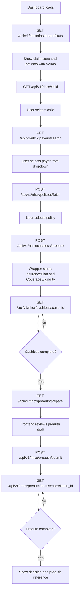

# NHCX Frontend Implementation Guide

This guide describes the frontend flow for the hospital-facing cashless workflow. The frontend calls only the wrapper APIs. It does not call NHCX directly and it does not call the lower-level InsurancePlan or CoverageEligibility APIs directly.

Frontend API contract: [FRONTEND_API.yaml](FRONTEND_API.yaml)

## Mermaid Flowchart



## Flow Summary

```text
1. Dashboard
   GET /api/v1/nhcx/dashboard/stats
   Show claim workflow stats from cashless cases.

2. Child Search
   GET /api/v1/nhcx/child?child_id=&name=&mobile=&limit=&offset=
   Select the patient/child for the workflow.

3. Payer Search
   GET /api/v1/nhcx/payers/search?name=&scheme=
   Populate payer dropdown.

4. Policy Fetch
   POST /api/v1/nhcx/policies/fetch
   Triggered when the user selects a payer.

5. Cashless Prepare
   POST /api/v1/nhcx/cashless/prepare
   Starts InsurancePlan and CoverageEligibility inside the wrapper.

6. Cashless Status
   GET /api/v1/nhcx/cashless/:case_id
   Poll until cashless status is complete or next action is clear.

7. Preauth
   GET /api/v1/nhcx/preauth/prepare
   POST /api/v1/nhcx/preauth/submit
   GET /api/v1/nhcx/preauth/status/:correlation_id
```

## Wireframe

```text
+--------------------------------------------------------------------------------+
| NHCX Cashless Dashboard                                                        |
+--------------------------------------------------------------------------------+
| Claims                                                                         |
| ------------------------------------------------------------------------------ |
| Total: 18   Pending: 6   Partial: 2   Complete: 9   Failed: 1                  |
| Preauth Pending: 4                  Patients With Claims: 13                   |
+--------------------------------------------------------------------------------+
| Child Search                                                                   |
| ------------------------------------------------------------------------------ |
| [ Child ID .... ] [ Name ........................ ] [ Mobile ........ ] [Find] |
|                                                                                |
| Results                                                                        |
|   ID   Name              Gender   DOB          Mobile       Latest Claim        |
|   12   Arjun Mehta       male     2020-01-01   9999999999   pending             |
|   19   Aisha Kapoor      female   2019-06-11   8888888888   complete            |
+--------------------------------------------------------------------------------+
| Payer & Policy                                                                 |
| ------------------------------------------------------------------------------ |
| Selected Child: Arjun Mehta                    Claim: 101                      |
|                                                                                |
| [ Search payer ...................................................... ]        |
| Payers                                                                         |
|   ( ) 1518@hcx  Sample Payer        PMJAY      active                          |
|   ( ) 2044@hcx  Sample Insurance    Retail     active                          |
|                                                                                |
| Policies for selected payer                                                    |
|   ( ) POL-91711234567890-2026   GeneralHealth-2026   INR 500000   active       |
|   ( ) POL-ALT-2026              Family Floater       INR 300000   active       |
|                                                                                |
| [Start Cashless Preparation]                                                   |
+--------------------------------------------------------------------------------+
| Cashless Preparation                                                           |
| ------------------------------------------------------------------------------ |
| Status: pending / partial / complete / failed                                  |
| Current Step: insurance_and_eligibility                                        |
|                                                                                |
| Procedures from DB                                                             |
|   47562  Laparoscopic cholecystectomy                                          |
|                                                                                |
| Insurance Plan                                                                 |
|   Benefits: inpatient, surgery, room rent                                      |
|   Exclusions: cosmetic surgery                                                 |
|   Documents: admission note, estimate, investigation reports                    |
|                                                                                |
| Coverage Eligibility                                                           |
|   In force: yes        Auth required: yes        Outcome: complete             |
|                                                                                |
| [Prepare Preauth]                                                              |
+--------------------------------------------------------------------------------+
| Preauth                                                                        |
| ------------------------------------------------------------------------------ |
| Diagnoses                         Procedures                                   |
|   K80.20 Calculus of gallbladder     47562 Laparoscopic cholecystectomy        |
|                                                                                |
| Bill Items                                                                      |
|   Service Code   Name                                  Qty   Amount            |
|   47562          Laparoscopic cholecystectomy           1    50000             |
|                                                                                |
| Documents                                                                      |
|   [x] Admission note      [x] Estimate      [ ] Investigation report           |
|                                                                                |
| [Submit Preauth]                                                               |
+--------------------------------------------------------------------------------+
| Preauth Status                                                                 |
| ------------------------------------------------------------------------------ |
| Status: pending / complete / not_found                                         |
| Decision: APPROVED / PARTIALLY_APPROVED / QUERIED / REJECTED                   |
| Preauth Ref: PA-2026-00001                                                     |
+--------------------------------------------------------------------------------+
```

## Frontend State

Keep the selected values in frontend state after each step:

| State | Source | Used By |
|---|---|---|
| `child_id` | `GET /nhcx/child` | policy fetch, cashless prepare, preauth prepare |
| `claim_id` | `latest_claim.claim_id` or current workflow context | cashless prepare, preauth prepare, preauth submit |
| `payer_code` | selected payer `participant_code` | policy fetch, preauth prepare, preauth submit |
| `policyNumber` | selected policy `policyNumber` | cashless prepare, preauth prepare, preauth submit |
| `case_id` | cashless prepare response | cashless status polling |
| `eligibility_correlation_id` | cashless status response | preauth submit |
| `preauth_correlation_id` | preauth submit response | preauth status polling |

## API Details

### 1. Dashboard Stats

```http
GET /api/v1/nhcx/dashboard/stats
```

Response:

```json
{
  "claims": {
    "total": 18,
    "pending": 6,
    "partial": 2,
    "complete": 9,
    "failed": 1,
    "preauth_pending": 4
  },
  "patients": {
    "with_claims": 13
  }
}
```

`claims` are counted from `nhcx_cashless_cases`. `patients.with_claims` is the number of unique `child_id` values with at least one cashless workflow.

### 2. Child Search

```http
GET /api/v1/nhcx/child?name=arjun&limit=20&offset=0
```

Supported filters:

| Query Param | Type | Notes |
|---|---|---|
| `child_id` | integer | Exact child ID lookup |
| `name` | string | Case-insensitive partial match |
| `mobile` | string | Exact mobile match |
| `limit` | integer | Defaults to `20` |
| `offset` | integer | Defaults to `0` |

Response:

```json
{
  "total_count": 1,
  "limit": 20,
  "offset": 0,
  "children": [
    {
      "child_id": 12,
      "name": "Arjun Mehta",
      "gender": "male",
      "dob": "2020-01-01",
      "mobile": "9999999999",
      "created_at": "2026-05-04T10:30:00+05:30",
      "cashless_cases_count": 1,
      "latest_claim": {
        "case_id": 4,
        "claim_id": 101,
        "status": "pending",
        "current_step": "insurance_and_eligibility",
        "payer_code": "1518@hcx",
        "policy_number": "POL-91711234567890-2026",
        "preauth_status": "pending",
        "created_at": "2026-05-04T10:35:00+05:30"
      }
    }
  ]
}
```

### 3. Payer Search

Use this to populate the payer dropdown.

```http
GET /api/v1/nhcx/payers/search?name=sample&scheme=PMJAY
```

Response:

```json
[
  {
    "participant_code": "1518@hcx",
    "name": "Sample Payer",
    "scheme_type": "PMJAY",
    "status": "active"
  }
]
```

When the user clicks a payer row, store `participant_code` as `payer_code` and immediately call policy fetch.

### 4. Policy Fetch

```http
POST /api/v1/nhcx/policies/fetch
Content-Type: application/json
```

Request:

```json
{
  "patientId": "12",
  "admissionId": "ADM123",
  "payerCode": "1518@hcx",
  "forceRefresh": false
}
```

Response:

```json
{
  "status": "success",
  "data": {
    "patient_id": "12",
    "payer_code": "1518@hcx",
    "identifier_used": {
      "type": "PatientId",
      "value": "12"
    },
    "policies": [
      {
        "policyNumber": "POL-91711234567890-2026",
        "productName": "GeneralHealth-2026",
        "payerId": "1518@hcx",
        "payerName": "Sample Payer",
        "status": "active",
        "sumInsured": 500000,
        "currency": "INR",
        "effectiveFrom": "2026-01-01",
        "effectiveTo": "2026-12-31"
      }
    ],
    "fetched_at": "2026-05-04T10:40:00+05:30"
  }
}
```

The frontend should let the user choose one policy. The selected `policyNumber` is required for cashless preparation and preauth.

### 5. Cashless Prepare

```http
POST /api/v1/nhcx/cashless/prepare
Content-Type: application/json
```

Request:

```json
{
  "claim_id": 101,
  "child_id": 12,
  "policyNumber": "POL-91711234567890-2026",
  "forceRefresh": false
}
```

Response status is `202 Accepted`:

```json
{
  "case_id": 4,
  "claim_id": 101,
  "child_id": 12,
  "payer_code": "1518@hcx",
  "policy_number": "POL-91711234567890-2026",
  "status": "pending",
  "current_step": "insurance_and_eligibility",
  "next_actions": ["refresh"],
  "procedures": {
    "source": "claim_db",
    "items": [
      {
        "category": "SE",
        "code": "47562",
        "name": "Laparoscopic cholecystectomy"
      }
    ]
  },
  "insurance_plan": {
    "status": "pending",
    "correlation_id": "550e8400-e29b-41d4-a716-446655440000"
  },
  "coverage_eligibility": {
    "status": "pending",
    "correlation_id": "9e5c60bf-4014-4b72-a2f0-1fe4f9a75e61",
    "outcome": null,
    "inforce": null,
    "auth_required": null,
    "insurance_items": [],
    "errors": []
  }
}
```

Poll the cashless status API until the status is `complete`, or until `next_actions` tells the UI what to do.

### 6. Cashless Status

```http
GET /api/v1/nhcx/cashless/4
```

Response:

```json
{
  "case_id": 4,
  "claim_id": 101,
  "child_id": 12,
  "payer_code": "1518@hcx",
  "policy_number": "POL-91711234567890-2026",
  "status": "complete",
  "current_step": "preauth_ready",
  "next_actions": ["prepare_preauth"],
  "procedures": {
    "source": "claim_db",
    "items": [
      {
        "category": "SE",
        "code": "47562",
        "name": "Laparoscopic cholecystectomy"
      }
    ]
  },
  "insurance_plan": {
    "status": "complete",
    "correlation_id": "550e8400-e29b-41d4-a716-446655440000",
    "plan_details": {},
    "inclusions": [],
    "exclusions": [],
    "pricing": [],
    "document_requirements": []
  },
  "coverage_eligibility": {
    "status": "complete",
    "correlation_id": "9e5c60bf-4014-4b72-a2f0-1fe4f9a75e61",
    "outcome": "complete",
    "disposition": "Eligible",
    "inforce": true,
    "auth_required": true,
    "insurance_items": [],
    "errors": []
  }
}
```

### 7. Preauth Prepare

```http
GET /api/v1/nhcx/preauth/prepare?claim_id=101&child_id=12&payer_code=1518@hcx&policyNumber=POL-91711234567890-2026
```

Response:

```json
{
  "claim_id": 101,
  "payer_code": "1518@hcx",
  "policy_number": "POL-91711234567890-2026",
  "patient": {
    "id": 12,
    "name": "Arjun Mehta",
    "gender": "male",
    "dob": "2020-01-01"
  },
  "admission_date": "2026-05-04",
  "inpatient": true,
  "urgent": false,
  "diagnoses": [
    {
      "code": "K80.20",
      "name": "Calculus of gallbladder",
      "primary": true,
      "on_admission": true
    }
  ],
  "procedures": [
    {
      "code": "47562",
      "name": "Laparoscopic cholecystectomy",
      "date": "2026-05-04"
    }
  ],
  "items": [
    {
      "service_code": "47562",
      "service_name": "Laparoscopic cholecystectomy",
      "category": "SE",
      "quantity": 1,
      "unit_price": 50000,
      "net_amount": 50000
    }
  ],
  "supporting_documents": [],
  "total_amount": 50000,
  "eligibility": {},
  "missing_fields": []
}
```

The frontend should render this as an editable draft, but keep `claim_id`, `payer_code`, and `policyNumber` intact.

### 8. Preauth Submit

```http
POST /api/v1/nhcx/preauth/submit
Content-Type: application/json
```

Request:

```json
{
  "claim_id": 101,
  "payer_code": "1518@hcx",
  "policyNumber": "POL-91711234567890-2026",
  "eligibility_correlation_id": "9e5c60bf-4014-4b72-a2f0-1fe4f9a75e61",
  "diagnoses": [
    {
      "code": "K80.20",
      "name": "Calculus of gallbladder",
      "primary": true,
      "on_admission": true
    }
  ],
  "procedures": [
    {
      "code": "47562",
      "name": "Laparoscopic cholecystectomy",
      "date": "2026-05-04"
    }
  ],
  "items": [
    {
      "service_code": "47562",
      "service_name": "Laparoscopic cholecystectomy",
      "category": "SE",
      "quantity": 1,
      "unit_price": 50000,
      "net_amount": 50000
    }
  ],
  "supporting_documents": [],
  "total_amount": 50000
}
```

Response status is `202 Accepted`:

```json
{
  "correlation_id": "5c2a6db0-b4c1-47e2-bf6d-3db2ed6e8f11",
  "preauth_ref": null,
  "policy_number": "POL-91711234567890-2026",
  "status": "submitted",
  "message": "Preauthorization request submitted"
}
```

### 9. Preauth Status

```http
GET /api/v1/nhcx/preauth/status/5c2a6db0-b4c1-47e2-bf6d-3db2ed6e8f11
```

Response:

```json
{
  "correlation_id": "5c2a6db0-b4c1-47e2-bf6d-3db2ed6e8f11",
  "claim_id": 101,
  "workflow": "preauth",
  "status": "complete",
  "decision": "APPROVED",
  "preauth_ref": "PA-2026-00001",
  "items": [],
  "totals": {},
  "errors": []
}
```

## Polling Rules

| API | When to Poll | Stop When |
|---|---|---|
| `GET /nhcx/cashless/:case_id` | After `cashless/prepare` returns `202` | `status` is `complete` or `failed` |
| `GET /nhcx/preauth/status/:correlation_id` | After `preauth/submit` returns `202` | `status` is `complete`, `not_found`, or errors are present |

Recommended polling interval is 5 to 10 seconds. The frontend should let the user refresh manually.

## UI Rules

- Disable policy fetch until a child and payer are selected.
- Disable cashless prepare until a child, claim, and policy are selected.
- Do not let the frontend send procedure lines to cashless prepare. The wrapper reads procedures from DB.
- Show `cashless.status = pending` as an in-progress state, not as an error.
- Start preauth only after cashless status returns enough InsurancePlan and CoverageEligibility data for review.
- Keep advanced preauth query response, resubmit, and cancel out of the frontend for now.
